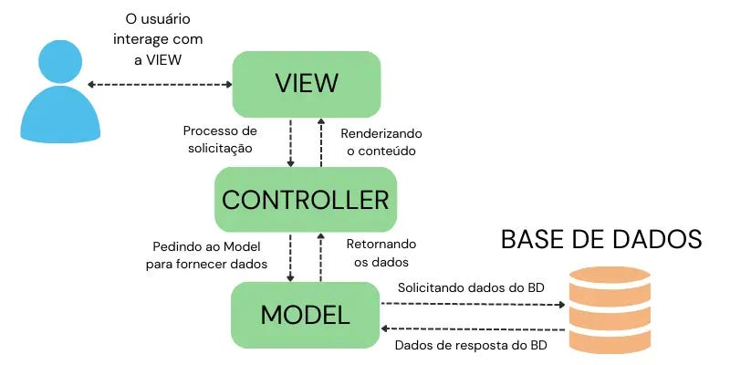

# CRIANDO PÁGINAS

1. Se voce não precisa armazenar dados.
   Cria uma pagina em resources/view
   Cria uma rota em   routes/web.php  apontando para a pagina.
   Se tem links na pagina, crie rotas para os links

2. Se precisa armazenar dados.
   Faça o processo acima.
   Depois, além da View e Rota,  terá que criar:
     Model
     Migration
     Controller

   Se precisa criar dados para teste, crie um Seeder e Factory.  

# Criar crud no padrão MVC (Model, View, Controller)

Criar o Model, Migration, View e Controller - se não já existir.
Se faltar algum destes faça a criação em separado pelo php artisan, conforme abaixo.

1. Criar o Model/Migrate e Controller - pelo comando php artisan, do item A.1
2. Criar a View
3. Criar o Controller e as funções para atender as views.

# A. CRIAR O MODEL, MIGRATE E CONTROLLER
# A.1. Criar, pelo terminal, o Model e o Controller e a Migration com o parametro abaixo --mcr.
   Lembre que o nome das Classes em que ter primeira letra maiúcula:  Exemplo- Departamento, Empresa.
   
   php artisan make:model NomeModel --mcr     // este parametro --mcr é:  m de Model, c de controller e r de recursos do controller
   Se precisar somente do Model use o comando sem os parametros

   se precisar somente o controller use:
   php artisan make:controller NomeController --r
 
   Use o parametro que precisar.
   Se precisar do factory e Seeder adicionar os comandos abaixo.
   -m (or --migration): Creates a database migration file for the model's table.
   -c (or --controller): Creates a controller for the model.
   -r (or --resource): Creates a resource controller with all standard CRUD methods.
   -f (or --factory): Creates a model factory for seeding the database.
   -s (or --seed): Creates a seeder class for the model.

# A.2. Preencher os dados do Model:
   Se tiver factory e seeder adiconar:

   Class Departamento extends Models
   {
        use HasFactory;     <----  Se tiver Factory e Seeder precisa deste

        protected $fillable = [      <--- Coloque os campos da tabela que podem ser criados ou alterados.
            'nome_departamento',          Se não colocar os campos não consegue gravar no banco de dados. 
            'sigla_departamento',
        ];
        
        Definir o relacionamento se tiver das FOREING KEYS,
          neste exemplo tem um belongsTo:
        
        public function user()
        {
            return $this->belongsTo(User::class);
        }
   }    

# A.3. Acertar o Migration
      Baseado no design do Banco de Dados, inclusive as FOREING KEYS.
      Lembre-se
      Nome das classes no Laravel é com primeira letrao Maiuscula no singular
           e das tabelas com letra minuscula no plural

      Exemplo:  classe: Departamento  e  tabela: departamentos      

        Schema::create('empresas', function (Blueprint $table) {
            $table->id()->autoIncrement();
            $table->string('nome',40);
            $table->bigInteger('grupo_economico_id')->unsigned();
            $table->foreign('grupo_economico_id')->references('id')->on('grupo_economicos');
            $table->string('cod_fiscal',14);
            $table->string('localidade',30);
            $table->timestamps();
        });

      executar a migração:  php artisan migration
      se tiver erros acerto.

      se tiver Seeder para preencher com dados de testes execute:
      php artisan db:seed --class=EmpresaSeeder

# B.CRIAR A VIEW
# B.1.Criar a View
    Se o sistema tiver poucos Models as views podem ficar numa unica pasta
    Com maior quantidade melhor criar pasta para cadas view correspondentes aos models

    resources
         Views
           departamento
           empresa
           etc...
    Pode ser criado manualmente ou atraves do comando php artisan
    
    php artisan make:view  departamento.index
    
    Depois, copie o codigo de outra view semelhante para agilizar a codificação
    Por exemplo, copie de outro index.blade.php e altere somente as variaveis correspondente ao novo Model.

# C. CRIAR ROTAS
# C.1.Criar as rotas 
   As rotas, em ingles "End point" é a intermediaria entre a View e o Controller

   Este é a forma mais simples de criar rotas. 
   Route::get('/videos', [VideoController::class, 'index'])->name('videos.index');
   Route::post('/videos/formats', [VideoController::class, 'listFormats'])->name('videos.formats');

   Rotas tem um Verbo para dizer sua atividade - GET, POST, PUT, DELETE...

    Verbo HTTP	URI	Ação no Controller	Nome da Rota
    GET	  /produtos	        index       produtos.index
    GET	  /produtos/create	create   	produtos.create
    POST  /produtos	        store	    produtos.store
    GET	  /produtos/{produto}	show	produtos.show
    GET	  /produtos/{produto}/edit	edit	produtos.edit
    PUT/PATCH	/produtos/{produto}	update	produtos.update
    DELETE	/produtos/{produto}	    destroy	produtos.destroy

# D. CODIFICAR O CONTROLLER
# D.1.Fazer ajustes no Controller
   O controle já virá com as funções padrões:  Index, create, store, update, etc...
   Se precisar de alguma diferente crie na ordem alfabetica.

   index  -  para listar 
   create -  para mostrar o formulario para criar
   store  -  para salver o formulario de criação
   update -  para mostrar o formulario para alteração

    Exemplo para ler todos os registros da tabela Produtos:
    
    o Controller usa a classe Model para ler o banco de dados.
    Nomes de Classes começa com letra Maiúscula e no singular -> Produto
    Nomes de tabelas começa com letra Minuúscola e no Plural  -> produtos
        
        namespace Controller;

        use App\Models\Produto;

        // ...
        public function index()
        {
            // Obtém todos os produtos no Model Produto e os envia para a view
            // View('produtos.index...  quer dizer na pasta produtos o arquivo index - produtos.index
            // View('produtos.index', [ este segundo parametro é para fazer um array da variavel $produtos e enviar
            //                          para a view]).

            $produtos = Produto::all();     ---> para pegar tudo usa all(), se tem uma condição usa get().
            return view('produtos.index', ['produtos' => $produtos]);
        }

    O controller é quem faz o meio de campo entre a View e o Banco de Dados:
    Exemplos:
    Pega a informação fornecida pelo Usuário, faz a validação e grava no banco de dados ou
    Pega a solicitação do usuário, busca no banco de dados e devolve para a view.
    
    Pega dados digitados na tela do usuário, faz calculos e devolve para a View.

